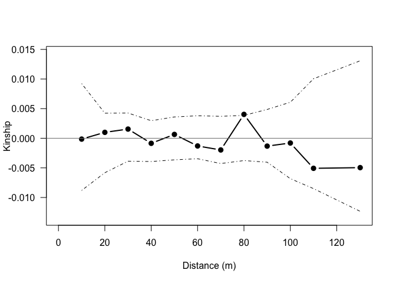

### sgsR

*sgsR* is a package for calculating spatial genetic structure in R. The aim is to implement analyses, similar to those found in [SPAGeDi](http://ebe.ulb.ac.be/ebe/SPAGeDi.html) and [GenAlEx](http://biology-assets.anu.edu.au/GenAlEx/Welcome.html), that estimate the degree of spatial autocorrelation in genetic data.

Some key features of sgsR are:

1.  Calculating relatedness among individuals based on set distance intervals
2.  Conducting permutation tests
3.  Creating spatial autocorrelation plots
4.  Reading and converting from SPAGeDi data format

===============

sgsR is very much still in development, and certainly contains many bugs. If you're interested in contributing, have any comments or suggestions, please get in touch via github or email - <lukembrowne@gmail.com>

===============

To install sgsR, you must first make sure the package 'devtools' is installed. This will allow you to install sgsR directly from github.

``` r

install.packages("devtools")

devtools::install_github("lukembrowne/sgsR")
```

=================

Here's an example of a typical workflow...

-   Input data into the sgs data structure using createSgsObj()
-   Set desired distance intervals and number of permutations
-   Run SGS analysis with sgs(), currently configured to run the kinship coefficient of Loiselle et al. 1995
-   use plotSgs() to produce an autorcorrelation plot

``` r

library(sgsR)

## Simulate genetic data
    Nind = 100
    Nloci = 10
    Nallele = 10
    n =  Nind * 2 # Number of gene copies

    ## Initialize data frame
    dat <- data.frame(id = 0:(Nind-1))
    dat$x = runif(Nind, 0, 100)
    dat$y = runif(Nind, 0, 100)

    ## Simulate Random genetic data
    for(loci in 1:Nloci){
      loci_name_a = paste("Loc", loci, "_A", sep = "")
      loci_name_b = paste("Loc", loci, "_B", sep = "")
      dat[loci_name_a] <- sample.int(Nallele, Nind, replace = TRUE)
      dat[loci_name_b] <- sample.int(Nallele, Nind, replace = TRUE)
    }

## Convert to sgsObj
sgsObj = createSgsObj(sample_ids = dat$id, 
                      genotype_data = dat[, 4:(Nloci*2 + 3)],
                      ploidy = 2,
                      x_coords = dat$x, 
                      y_coords = dat$y)

# Display genetic data
head(sgsObj$gen_data)
#>   Loc1_A Loc1_B Loc2_A Loc2_B Loc3_A Loc3_B Loc4_A Loc4_B Loc5_A Loc5_B
#> 1      5      2      9      4      4      4      7      1      1      2
#> 2      3      9     10     10      5      9      9      4     10      6
#> 3      5      2      8      4     10      9      2      9      5      3
#> 4      7      5     10      6     10      2     10      1      6      6
#> 5      8      5      3      6      4      7      1      3      9      5
#> 6      4      4      4     10      8      5      5      6      5      5
#>   Loc6_A Loc6_B Loc7_A Loc7_B Loc8_A Loc8_B Loc9_A Loc9_B Loc10_A Loc10_B
#> 1      5      9      5      5      3      3      2      2       2       6
#> 2      8     10      1      9      4      8      4      9       5       6
#> 3      2     10     10      7      5      8      7     10       7       9
#> 4      2      8      8      1      4      2      4      7       4       4
#> 5      5      9      1      3      7      8     10      2       3       9
#> 6      8      6      9      3      8      4     10      9       1       8


## Run analysis
distance_intervals = seq(10, 110, 10) # Set distance intervals

out1 = sgs(sgsObj = sgsObj, distance_intervals = distance_intervals, nperm = 99)
#> Adding an aditional distance interval -- 130.1137 -- to encompass all pairwise distances.. 
#> Working on permutation: 0...


## Plotting results

## Solid line is Fij estimate for each distance class
## Dashed lines are the 2.5 % and 97.5 % quantiles of the permuted values
plotSgs(out1)
```



``` r

# Summary of information on distance classes
round(out1$DIsummary, 3)
#>                     [,1]    [,2]    [,3]    [,4]    [,5]    [,6]    [,7]
#> Distance class     0.000   1.000   2.000   3.000   4.000   5.000   6.000
#> Max distance      10.000  20.000  30.000  40.000  50.000  60.000  70.000
#> Average distance   6.407  15.578  25.245  35.046  45.027  55.091  65.033
#> Number of pairs  140.000 365.000 540.000 615.000 686.000 683.000 609.000
#>                     [,8]    [,9]   [,10]   [,11]   [,12]
#> Distance class     7.000   8.000   9.000  10.000  11.000
#> Max distance      80.000  90.000 100.000 110.000 130.114
#> Average distance  74.986  84.783  94.563 104.218 116.444
#> Number of pairs  520.000 381.000 244.000 114.000  53.000

# Summary of information on estimated Kinship coefficient for each distance class (columns)
round(out1$Fijsummary, 3)
#>            [,1]   [,2]   [,3]   [,4]   [,5]   [,6]   [,7]   [,8]   [,9]
#> Loc1_A    0.002  0.017 -0.003  0.009 -0.005 -0.001 -0.004  0.005  0.001
#> Loc2_A    0.014 -0.015  0.001 -0.001  0.002 -0.001 -0.004  0.002  0.008
#> Loc3_A   -0.002  0.005  0.001  0.001 -0.004 -0.002  0.000  0.003 -0.001
#> Loc4_A   -0.018 -0.001  0.009 -0.006  0.007 -0.011 -0.006  0.002  0.012
#> Loc5_A   -0.028 -0.008  0.002  0.011 -0.005 -0.001  0.002  0.012 -0.003
#> Loc6_A    0.010  0.011  0.000 -0.004 -0.001 -0.001 -0.010  0.010 -0.002
#> Loc7_A   -0.002 -0.003 -0.011 -0.002  0.010  0.000  0.000  0.006 -0.001
#> Loc8_A    0.001  0.004  0.011 -0.003 -0.002  0.003 -0.002  0.003 -0.006
#> Loc9_A    0.034  0.004  0.004 -0.005 -0.001 -0.001  0.007 -0.008 -0.015
#> Loc10_A  -0.014 -0.005  0.001 -0.007  0.005  0.002 -0.002  0.005 -0.005
#> ALL LOCI  0.000  0.001  0.002 -0.001  0.001 -0.001 -0.002  0.004 -0.001
#>           [,10]  [,11]  [,12]
#> Loc1_A   -0.011 -0.019 -0.026
#> Loc2_A    0.010  0.001 -0.013
#> Loc3_A   -0.012  0.021 -0.015
#> Loc4_A    0.006  0.010 -0.025
#> Loc5_A   -0.009 -0.017 -0.010
#> Loc6_A    0.005 -0.029  0.030
#> Loc7_A    0.001 -0.012  0.013
#> Loc8_A   -0.005 -0.015 -0.035
#> Loc9_A    0.004  0.004 -0.003
#> Loc10_A   0.002  0.004  0.034
#> ALL LOCI -0.001 -0.005 -0.005
```

=================
